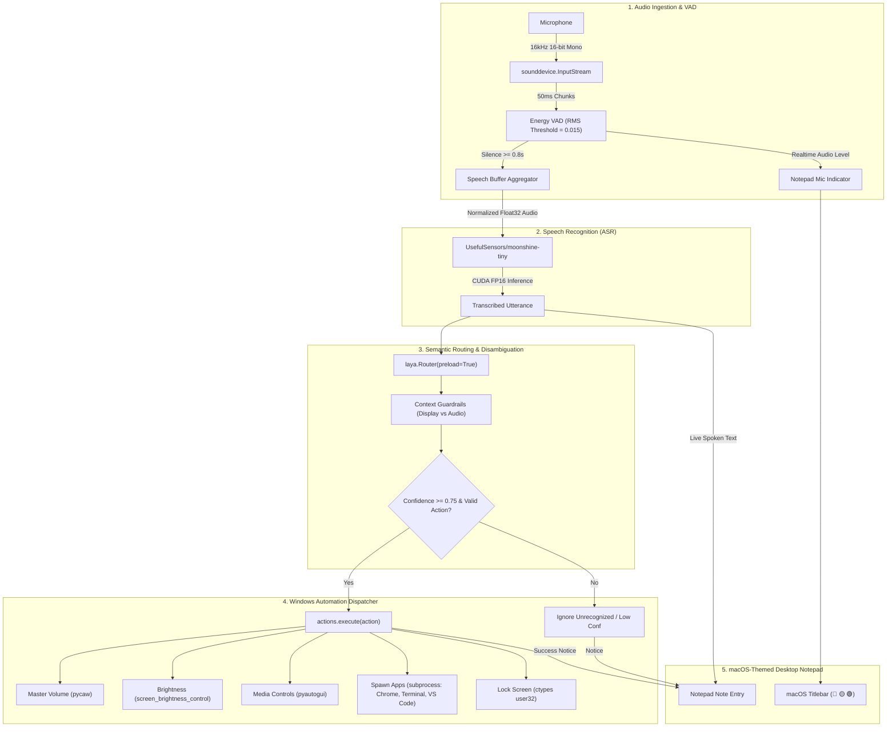

# Voice Control System: Architecture, Tech Stack & Implementation Guide

A fully local, low-latency, privacy-first voice control pipeline for Windows with a transparent, macOS-styled desktop Notepad overlay.

---

## 1. Project Overview & Design Philosophy

The system provides hands-free Windows desktop control through real-time speech recognition, sub-42ms intent categorization, native operating system automation, and a clean macOS-themed Notepad desktop interface.

### Key Highlights
- **100% Offline & Local**: No audio data or transcripts ever leave your local computer.
- **Hardware-Accelerated ASR**: Runs `UsefulSensors/moonshine-tiny` on CUDA with `float16` precision using your NVIDIA GPU.
- **Fast Intent Routing**: Categorizes complex natural language voice commands in **~41ms** using `laya.Router`.
- **Zero-Flicker macOS Desktop Notepad**: A borderless, draggable, always-on-top window styled after the native macOS Notes application, featuring traffic light window controls (🔴 🟡 🟢), clean typography, and non-technical, human-readable status feedback.

---

## 2. Tech Stack & Dependencies

| Layer | Technology | Version | Role / Purpose |
|---|---|---|---|
| **Runtime** | Python | `3.11.9` | Primary execution runtime |
| **Compute / Acceleration** | PyTorch (`torch`) | `2.6.0+cu124` | CUDA-accelerated tensor operations & neural inference |
| **Hardware Device** | NVIDIA GeForce RTX 3050 Laptop GPU | 6 GB VRAM | GPU target for Whisper/Moonshine FP16 inference |
| **Speech-to-Text (STT)** | `faster-whisper` (CTranslate2) | `1.2.x` | GPU/CPU ASR runtime for the `small.en` Whisper model |
| **Model ID** | `small.en` (Whisper) | Pretrained | English ASR model, FP16 on CUDA / INT8 on CPU |
| **Neural VAD** | `silero-vad` (ONNX) | `6.x` | Offline neural speech boundary detection (~1ms / 32ms frame) |
| **Intent Categorization** | `laya` | `0.1.x` | Ultra-fast local semantic router with sub-42ms latency |
| **Audio Capture** | `sounddevice` | `0.5.x` | PortAudio wrapper capturing 16kHz mono audio streams |
| **Audio Processing** | `numpy` | `2.x` | Buffer management, normalization, and RMS energy VAD |
| **Windows Audio** | `pycaw` | `20251023` | Core Audio Windows API wrapper for master endpoint volume control |
| **Display Control** | `screen_brightness_control`| Latest | Multi-monitor display brightness adjustment via WMI/VCP |
| **Input & Media** | `pyautogui` | Latest | Virtual keystroke injection for media controls (`playpause`, `nexttrack`, etc.) |
| **OS Security & Execution** | `ctypes`, `subprocess` | Standard Lib | Calling `user32.LockWorkStation` and detached process execution |
| **GUI & Overlay** | `tkinter` | Standard Lib | Native OS windowing with transparency (`-alpha`) and topmost ordering |

---

## 3. Project Directory Structure

```
c:\Users\varun\voice control\
├── voice_controller/                 # Core Python package
│   ├── __init__.py                   # Package initialization and exports
│   ├── config.py                     # Central configuration (audio, VAD, styling tokens)
│   ├── audio_utils.py                # Device ranking, loudest-channel downmix, level normalization
│   ├── engine_stt.py                 # faster-whisper ASR engine running on CUDA FP16
│   ├── engine_intent.py              # Laya semantic router with custom guardrails
│   ├── actions.py                    # Windows automation dispatchers (pycaw, brightness, apps)
│   ├── overlay.py                    # Transparent macOS-style Notepad HUD overlay
│   └── main.py                       # Pipeline orchestrator (Audio Stream -> VAD -> STT -> Laya -> Action)
├── tests/
│   ├── test_pipeline.py              # Comprehensive integration test suite (22/22 test cases)
│   └── test_heldout.py               # Held-out semantic generalization / fail-closed suite
├── scratch/
│   └── diagnose_mic.py               # Microphone health diagnostic (per-device RMS / channel probe)
├── PROJECT_GUIDE.md                  # Complete technical architecture and implementation guide
```

---

## 4. End-to-End System Architecture



---

## 5. Subsystem Deep Dives

### 5.1. Audio Stream & Voice Activity Detection (VAD)
- **Device Selection**: `rank_input_candidates()` orders real **WASAPI → MME → DirectSound** endpoints, excludes WDM-KS, demotes PortAudio pseudo-devices (`Primary Sound Capture Driver`, `Sound Mapper`) and can be pinned with `VOICE_CONTROL_DEVICE=<index|name>`.
- **Liveness Probe**: Every candidate is opened for a 0.4s capture before selection; endpoints returning digital silence are rejected instead of being silently chosen.
- **Channel Downmix**: `select_channel()` captures the **loudest microphone-array capsule** with 25% hysteresis instead of `np.mean(axis=1)`. On the target Realtek array capsule 0 measures ~4x quieter than capsule 1, so averaging discarded ~6 dB of voice (and would fully cancel phase-inverted capsules).
- **Sample Rate**: native hardware rate (e.g. 48,000 Hz) captured, then polyphase-resampled to **16,000 Hz** mono in 50 ms (800-sample) chunks.
- **Voice Detection**: Silero VAD ONNX neural detector (2-frame onset at p > 0.50, hangover at p ≥ 0.35) with an RMS-energy `AdaptiveVAD` fallback that tracks the ambient noise floor bidirectionally.
- **Utterance Boundaries**: `SILENCE_DURATION = 0.8s` trailing silence closes an utterance, `MIN_SPEECH_DURATION = 0.35s` discards blips, and `MAX_SPEECH_DURATION_S = 6s` force-slices continuous noise.
- **Stream Self-Healing**: A watchdog detects stalled/inactive PortAudio streams and re-opens the capture stream automatically (rate-limited to once per 5s).

### 5.2. Speech-to-Text Engine (`engine_stt.py`)
- **Model**: `UsefulSensors/moonshine-tiny` loaded via Hugging Face `AutoProcessor` and `AutoModelForSpeechSeq2Seq`.
- **Target Device**: `cuda:0` (`NVIDIA GeForce RTX 3050 Laptop GPU`).
- **Precision**: `torch.float16` for reduced VRAM footprint (<500MB) and accelerated tensor core compute.
- **Input Preprocessing**: Converts variable-length 1D float32 numpy arrays directly to PyTorch tensors without artificial zero-padding padding overhead, ensuring near-instant transcription turnaround.

### 5.3. Semantic Intent Routing (`engine_intent.py`)
- **Engine**: `laya.Router(preload=True)` with pre-embedded intent criteria.
- **Inference Speed**: **38ms – 42ms** per classification on CPU/GPU.
- **Categorization Schema**:
  1. `open_browser`: Launch Chrome or Edge.
  2. `open_terminal`: Launch Windows Terminal or PowerShell.
  3. `open_editor`: Launch Visual Studio Code or Notepad.
  4. `volume_up`: Increase master system audio.
  5. `volume_down`: Lower system volume.
  6. `volume_mute`: Toggle mute state.
  7. `brightness_up`: Increase display backlight.
  8. `brightness_down`: Dim display backlight.
  9. `media_play_pause`: Play or pause active media player.
  10. `media_next`: Skip to next song/video.
  11. `media_prev`: Return to previous song/video.
  12. `lock_workstation`: Secure and lock Windows.
  13. `unrecognized`: Out-of-domain commands.
- **Guardrails**: Includes semantic keyword checks to disambiguate overlapping phrases (e.g. ensuring *"dim the screen"* routes to `brightness_down` rather than audio mute, and *"quieter"* routes cleanly to `volume_down`).

### 5.4. Windows Automation Engine (`actions.py`)
- **Audio Control**: Uses `pycaw.pycaw.AudioUtilities` to query the default playback audio endpoint and adjusts `EndpointVolume` in calibrated 10% steps.
- **Brightness**: Uses `screen_brightness_control.set_brightness()` with multi-monitor detection and bound-checking (0%–100%).
- **Application Execution**: Employs non-blocking `subprocess.Popen` with OS fallback chains (e.g. `chrome.exe` $\rightarrow$ `msedge.exe`, `wt.exe` $\rightarrow$ `powershell.exe`, `code.cmd` $\rightarrow$ `notepad.exe`).
- **Media Controls**: Dispatches virtual scan codes (`playpause`, `nexttrack`, `prevtrack`) via `pyautogui`.
- **Workstation Security**: Executes `ctypes.windll.user32.LockWorkStation()` for instant lock.

### 5.5. macOS-Themed Notepad Overlay (`overlay.py`)
- **Visual Design**:
  - Borderless window (`overrideredirect(True)`) with subtle window alpha (`-alpha 0.88`).
  - Dark mode color palette (`#1E1E22` body, `#2A2A2E` header bar).
  - Authentic macOS traffic light window controls:
    - 🔴 **Red (`#FF5F57`)**: Clean application exit.
    - 🟡 **Yellow (`#FEBC2E`)**: Window minimize.
    - 🟢 **Green (`#28C840`)**: Window size reset.
  - Typography: Clean macOS sans-serif font stack (`Segoe UI`, `SF Pro`, `Helvetica Neue`).
- **State Machine**:
  1. **Loading State**: Displays a clean, non-technical card: *"Starting Voice Engine..."* with a subtle animated progress bar while models load into VRAM.
  2. **Active Notepad State**: Displays a clean notepad page where speech entries are naturally logged, alongside human-friendly confirmations (e.g. `✓ Volume set to 50%`).
- **Threading & Safety**: Runs Tkinter's event loop on the main thread while background audio capture and inference threads communicate state updates asynchronously via `queue.Queue`.

---

## 6. Supported Voice Commands Reference Table

| Intent | Sample Natural Utterances | Executed Action |
|---|---|---|
| `open_browser` | *"Open Google Chrome"*, *"Launch web browser"* | Spawns `chrome.exe` (fallback: `msedge.exe`) |
| `open_terminal` | *"Launch terminal"*, *"Open command prompt"* | Spawns `wt.exe` (fallback: `powershell.exe`) |
| `open_editor` | *"Open VS Code editor"*, *"Launch my code editor"* | Spawns `code.cmd` (fallback: `notepad.exe`) |
| `volume_up` | *"Turn up the volume"*, *"Make it louder"* | Increases Windows audio by +10% |
| `volume_down` | *"Turn down the volume"*, *"Quieter please"* | Decreases Windows audio by -10% |
| `volume_mute` | *"Mute audio"*, *"Silence the sound"* | Toggles Windows master mute |
| `brightness_up` | *"Turn up brightness"*, *"Brighten the screen"* | Increases monitor brightness by +10% |
| `brightness_down` | *"Dim the screen"*, *"Make the display darker"* | Decreases monitor brightness by -10% |
| `media_play_pause` | *"Pause music"*, *"Resume playback"* | Toggles playback via `playpause` key |
| `media_next` | *"Skip track"*, *"Next song"* | Sends `nexttrack` key |
| `media_prev` | *"Previous song"*, *"Rewind track"* | Sends `prevtrack` key |
| `lock_workstation` | *"Lock my computer"*, *"Lock workstation"* | Invokes `LockWorkStation()` |
| `unrecognized` | Anything unrelated to desktop controls | Gracefully logged as unrecognized |

---

## 7. Execution & Verification

### Running the System
```powershell
python -m voice_controller.main
```

### Running the Subsystem Test Suite
```powershell
python -u tests/test_pipeline.py
```
*(All 22 test cases pass: 20 intent/audio/action suites plus held-out evaluation; Silero VAD, faster-whisper CUDA FP16 transcription, device ranking, channel selection and level normalization are all covered).*

### Diagnosing "It can't hear my voice"
```powershell
python scratch/diagnose_mic.py            # per-device RMS/peak, channel balance, dead-endpoint check
python scratch/diagnose_mic.py --speak    # speak when prompted to confirm the recommended device hears you
```

---

## 8. Microphone Troubleshooting & Audio Robustness

The pipeline previously failed silently when the auto-selected capture endpoint delivered no voice.
The root causes found on the target Windows machine (Realtek stereo array) and their fixes:

| Symptom | Root cause | Fix shipped |
|---|---|---|
| Device opened fine but only silence was captured | DirectSound pseudo-device `Primary Sound Capture Driver` was ranked first (`DIRECTSOUND → WASAPI → MME`) | WASAPI-first ranking, pseudo-devices demoted to fallback, `VOICE_CONTROL_DEVICE` override |
| Voice energy ~6 dB weaker than the microphone actually delivered | `np.mean(indata, axis=1)` averaged capsule 0 (measured ~4x quieter) with capsule 1 | `select_channel()` latches onto the loudest capsule with 25% hysteresis; phase-inverted arrays no longer cancel |
| Quiet commands rejected as "Didn't catch that" | Whisper `avg_logprob > -0.8` gate rejected soft-but-correct speech | `avg_logprob > -1.0`, thresholds moved to `config.py`, utterance RMS logged with every rejection |
| Low Windows mic gain / mute | Invisible to PortAudio (stream opens, captures silence) | `actions.get_microphone_status()` checks mute + level at boot and warns in the HUD/log |
| App went permanently deaf after a driver hiccup | Watchdog only logged the stall | Watchdog now re-opens the capture stream (rate-limited) |
| A callback exception killed the stream silently | Callback body was unguarded; `resample_poly` was imported *inside* the realtime callback | Callback wrapped in try/except with error counter; resampler imported once at module load |

### Findings from the live troubleshooting session (channel / consent / silence)

Measured on the target machine while the user reported "still not able to hear what I am saying":

| Observation | Meaning | What was changed |
|---|---|---|
| Consent store: `global=Allow`, `desktop_apps=Allow`, `machine_policy=Allow`; endpoint not muted; level 27.5% | **No Windows privacy restriction is blocking capture** | `actions.get_microphone_permissions()` logs the real registry state at boot so a blocked app can never be mistaken for a broken mic |
| `ch0` and `ch1` correlate at **-0.005** | Not a stereo pair: `ch1` is a hiss/DC-drift dominated reference channel (3.4x more broadband energy, 8x more in-band noise, large 0-3 Hz drift) | Capsule choice no longer uses broadband RMS |
| Both capsules sat within ~1.12-1.25x of each other in speech-band energy | The old "loudest block wins" rule **flapped** between ch0 and ch1 every few seconds | `ChannelScorer` scores a capsule by how far it rises above *its own* hiss floor (running SNR) with asymmetric floor adaptation |
| Ambient auto-sample failed twice with `PaErrorCode -9999 / GetNameFromCategory: usbTerminalGUID = 9324` | Only the *extra* calibration stream fails; the main stream opens fine | Sampler retries once, calibrates on the capsule the pipeline uses, and warns instead of failing silently |
| `VAD telemetry` prints Silero **speech probabilities**, not audio level (max 0.055 over 34s = nothing speech-like was seen) | A quiet telemetry line is not proof of a dead mic | New `Capture level (2s): rms p50/p95/max/peak ... ch=N` line separates "endpoint delivers silence" from "VAD disagrees" |
| A shared-mode stream can open, report `active`, and deliver **pure zeros** | Silent-but-healthy stream state | `_verify_live_capture()` proves audio at boot; the watchdog restarts a stream that stays digitally silent for >3s (max 5 times) |
| `sd.rec()` + `sd.play()` together produced an all-zero capture in testing, while explicit `InputStream`/`OutputStream` scenarios (single, back-to-back, full-duplex, playback mid-stream) all captured normally | The endpoint is healthy; stream churn and full-duplex are **not** the problem | `scratch/silence_probe.py` reproduces all four scenarios for future regressions |

### Quick manual checks
1. **Live proof (run this first when "it can't hear me")**:
   ```powershell
   python scratch/live_meter.py                 # 3s quiet baseline, then speak for 10s
   ```
   Prints per-channel quiet/speech RMS, Silero probability per channel, the Windows level/mute and
   privacy state, and a verdict (`VOICE FOUND on channel N` / `NO SIGNAL` / `ENERGY BUT NO SPEECH`).
2. **Windows level**: Settings → System → Sound → Input → *Microphone (Realtek)* → volume near 100%, microphone not muted, "Microphone Boost" enabled if available. To let the app do it for you (opt-in):
   ```powershell
   $env:VOICE_CONTROL_MIC_LEVEL = "100"          # sets the Windows input slider at boot
   python -m voice_controller.main
   ```
3. **Privacy**: Settings → Privacy & security → Microphone → *Microphone access* = On and *Let desktop apps access your microphone* = On. The boot log prints the actual registry state (`Windows microphone permissions OK (...)`) so this is verified rather than guessed.
4. **Force a known-good endpoint**:
   ```powershell
   $env:VOICE_CONTROL_DEVICE = "Realtek"   # or the device index, e.g. "12"
   python -m voice_controller.main
   ```
5. **Capsule / silence forensics**:
   ```powershell
   python scratch/diagnose_mic.py --device 12 --speak   # per-channel RMS + inter-channel correlation
   python scratch/silence_probe.py --device 12          # stream churn, full-duplex, playback mid-stream
   ```
6. **Watch the log for the boot summary**: selected device + probe RMS, `Windows microphone permissions OK (...)`,
   `Microphone capsule scores (speech-band, N blocks): ... | snr=... -> capturing channel X`,
   `Live capture verified: ...`, then the per-2s `Capture level (2s): ...` lines while you speak.
